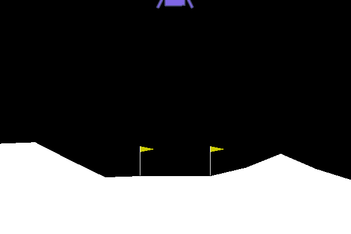
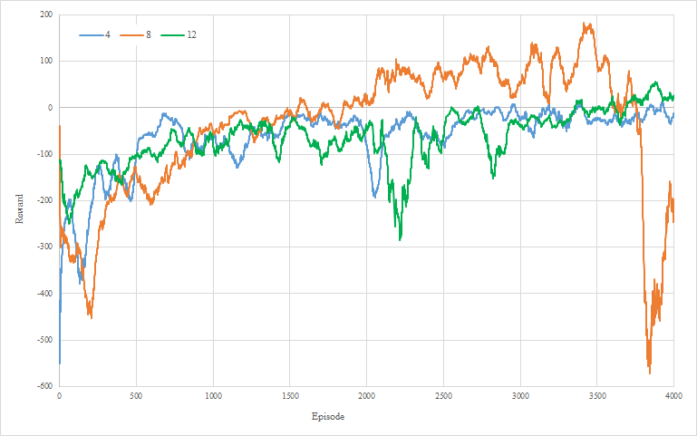
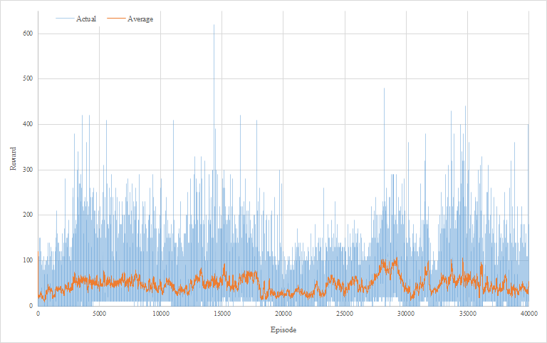

# SPPO
Basic implementation of a Proximal Policy Optimization (PPO) algorithm using TensorFlow 2.0 and OpenAI Gym Retro. The implementation is a single thread synchronous version. The PPO paper is found here: [Proximal Policy Optimization Algorithms](https://arxiv.org/abs/1707.06347)

# Notes
TensorFlow 2.1, OpenAI Gym, and Gym Retro are required.
A Lunar Lander version is provided that does not need a rom otherwise rom files are not included due to copyright concerns.
You need to provide your own. The ones I used are:
1. Joust (USA).nes
2. Ms. Pac-Man (USA).nes
3. Space Invaders (Japan).nes
4. Super Mario Bros. (World).nes

# Usage
Run main.py, be sure to install your roms (code to install roms is provided, rom is not).
Run lunar.py to train on Lunar Lander Gym environment.
There are various lines of codes that shows examples on how to create agent, train agent with checkpoints, load models, and play games.
Models for the various checkpoints shown below are provided in the models directory.

# Work In Progress
Currently the implentation converges on Lunar Lander but does not on NES games even when left training for days.
Hyperparameters have not been tuned which is a possible reason why.

## Lunar Lander
Ran three times for 4,000 epsiodes for 4, 8, and 12 episodes per batch.
Actor (alpha) and critic (beta) learning rates were both 1e-5 and entropy beta was 0.01. All other hyperparameters were kept as the default value I set.

| Episode 100   | Episode 1500  | Episode 2300  |
| ------------- | ------------- | ------------- |
|  |  |  |

## Space Invaders
Ran once for 40,000 epsiodes.
Actor (alpha) and critic (beta) learning rates were both 1e-5, entropy beta was 0.01 and number of episodes per batch was 8. All other hyperparameters were kept as the default value I set.
| Episode 100   | Episode 4000  | Episode 6900  |
| ------------- | ------------- | ------------- |
|  |  |  |

